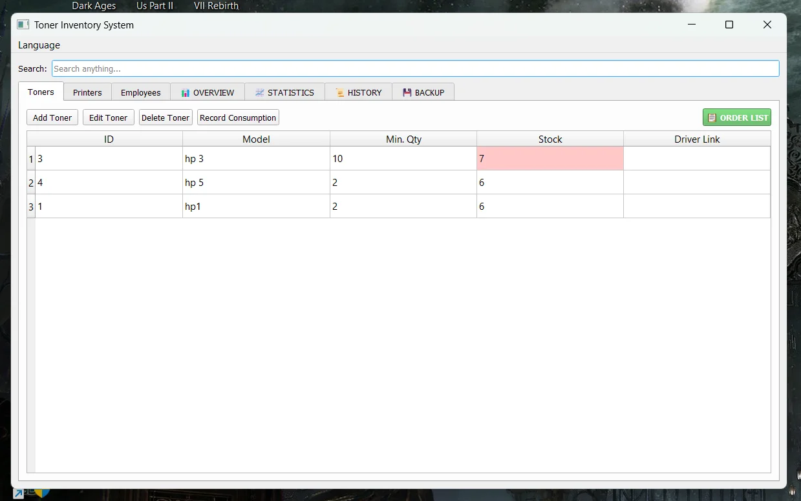
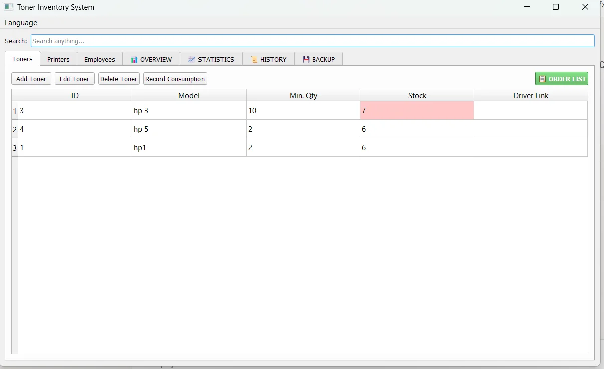
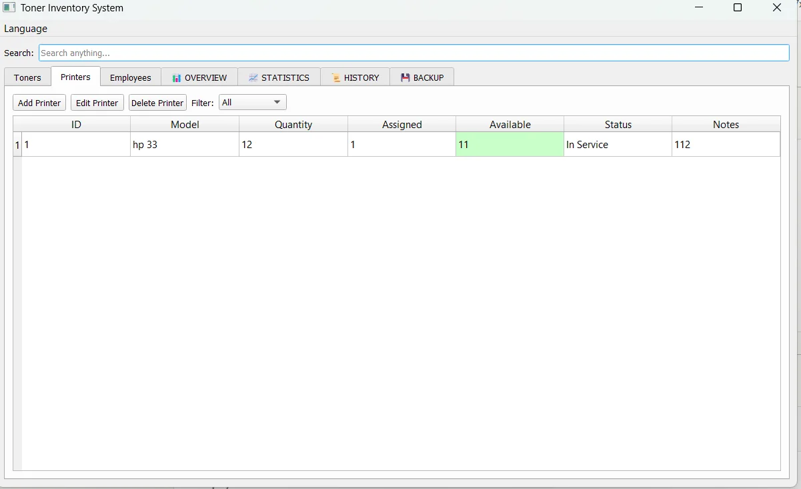
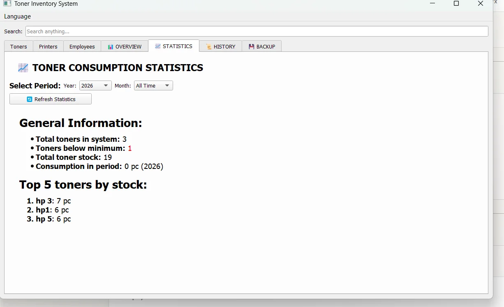
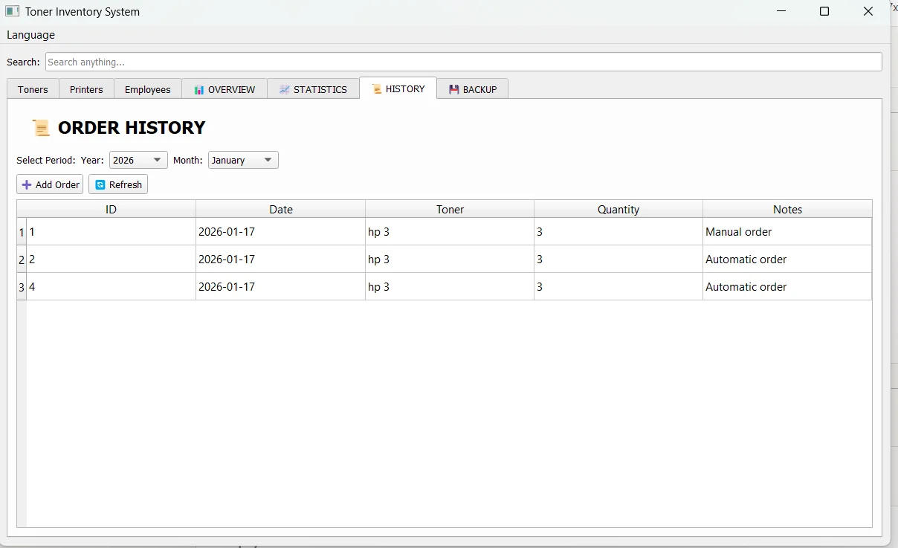
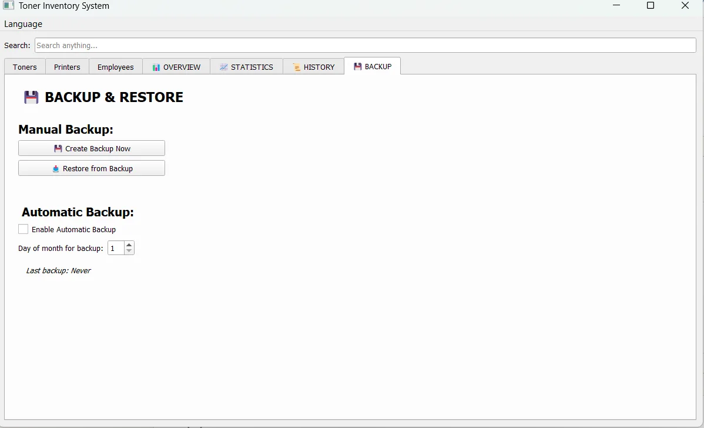
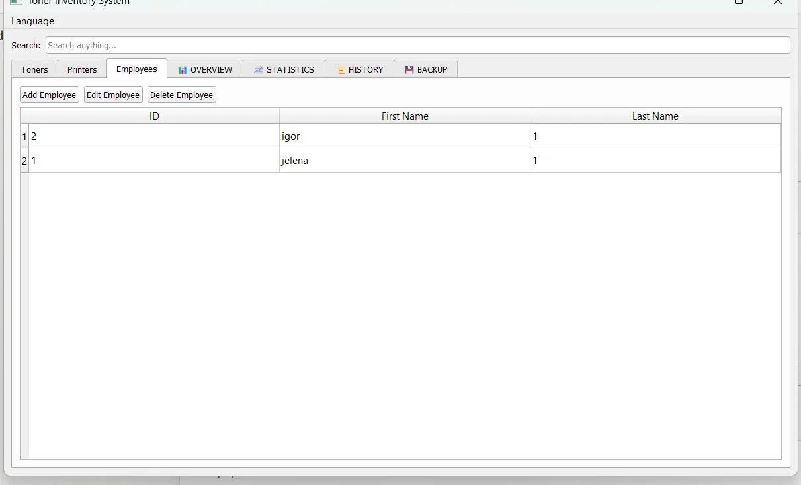
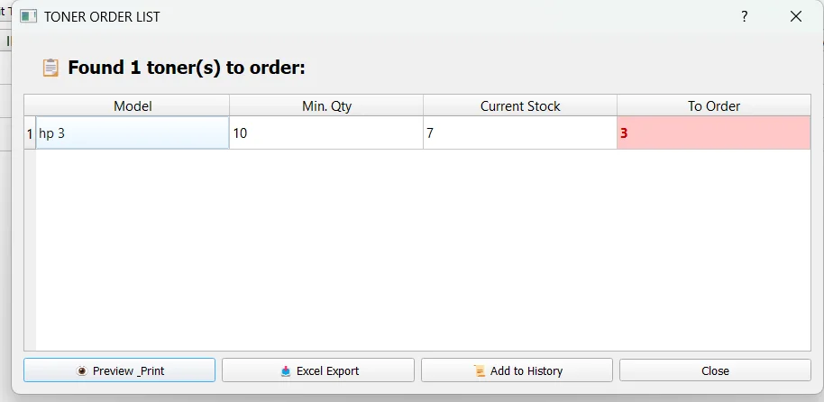

# 🖨️ Toner Inventory System

**Professional desktop application for managing printer toners, printers, and employee assignments.**

[](https://opensource.org/licenses/MIT)
[](https://www.python.org/downloads/)
[](https://pypi.org/project/PyQt5/)

---

## 📸 Screenshots

### Toner Management

*Track toner stock levels with automatic reordering alerts*

### Printer Inventory

*Manage printer quantities, assignments, and availability*

### Dual Language Support

*Full Serbian and English language support*

### Statistics & Reports

*Monthly and yearly consumption statistics*

### Order History

*Track all orders with flexible filtering*

### Backup & Restore

*Automatic and manual backup system*

### Employee Management

*Track printer assignments per employee*

### Order List (English)

*Smart ordering system with export options*

---

## ✨ Features

### 📦 **Toner Management**
- Track stock levels and minimum quantities
- Automatic reordering alerts when below minimum
- Quick stock reduction (inline editing)
- Excel & HTML export for order lists
- Driver link storage for easy access

### 🖨️ **Printer Inventory**
- **Quantity tracking** - Know exactly how many printers you have
- **Assignment management** - Track which employees have which printers
- **Availability monitoring** - See available vs. assigned counts at a glance
- **Smart validation** - Prevents over-assigning printers
- **Status tracking** - Active, In Service, For Disposal

### 👥 **Employee Management**
- Assign printers to employees
- Track printer assignments per employee
- Automatic validation (can't assign unavailable printers)

### 📊 **Statistics & Reporting**
- Monthly consumption reports
- Yearly consumption trends
- Top toners by stock/consumption
- Export to Excel or HTML

### 📜 **Order History**
- Track all toner orders with timestamps
- Filter by year and month
- Automatic cleanup (keeps 2 years of history)
- Manual order entry

### 💾 **Backup & Restore**
- **Automatic backups** - Schedule monthly backups
- **Manual backups** - Create backup anytime
- **Easy restore** - Restore from any backup file
- Safe restore process with pre-restore backup

### 🔍 **Smart Search**
- Real-time search across all tabs
- Highlighting of matching results
- Tab indicators for matches

### 🌐 **Dual Language**
- **Serbian (Српски)** - Full interface
- **English** - Complete translation
- Switch languages instantly

---

## 🚀 Quick Start

### Option 1: Executable (Windows - Easiest)

1. Download the latest `TonerInventory.exe` from [Releases](../../releases)
2. Run it - **no installation needed!**
3. Start managing your inventory

### Option 2: Run from Source (Cross-platform)

```bash
# 1. Install dependencies
pip install PyQt5 openpyxl

# 2. Run the application
python toner_app_multilang.py
```

### Option 3: Build Your Own EXE

```bash
# 1. Install PyInstaller
pip install pyinstaller

# 2. Run build script
python build_exe.py

# 3. Find executable in dist/ folder
```

See [BUILD_INSTRUCTIONS.md](BUILD_INSTRUCTIONS.md) for detailed build instructions.

---

## 🛠️ Tech Stack

- **Python 3.8+** - Core language
- **PyQt5** - Desktop GUI framework
- **SQLite** - Embedded database
- **openpyxl** - Excel file generation
- **PyInstaller** - EXE packaging

---

## 📦 Use Cases

Perfect for:
- 🏢 Small/medium businesses
- 🏫 Schools & universities
- 🏥 Hospitals & clinics
- 🏭 Manufacturing facilities
- 💼 IT support teams
- 📚 Libraries with print services

---

## 🌟 Why This Project?

Most inventory systems are:
- ❌ Web-based (complex setup, requires server)
- ❌ Too generic (not optimized for IT assets)
- ❌ English-only
- ❌ Expensive commercial software

**This project is:**
- ✅ Desktop app (zero configuration)
- ✅ IT-focused (printers/toners specific)
- ✅ Bilingual (Serbian/English)
- ✅ Free & Open Source
- ✅ Production-ready

---

## 📖 Documentation

- [Quick Start Guide](QUICK_START.md) - Get started in 5 minutes
- [Build Instructions](BUILD_INSTRUCTIONS.md) - Create your own EXE
- [Changelog](CHANGELOG.md) - Version history

---

## 🤝 Contributing

Contributions are welcome! Here's how:

1. Fork the repository
2. Create a feature branch (`git checkout -b feature/AmazingFeature`)
3. Commit your changes (`git commit -m 'Add some AmazingFeature'`)
4. Push to the branch (`git push origin feature/AmazingFeature`)
5. Open a Pull Request

**Ideas for contributions:**
- 🌍 Additional language translations
- 📊 More statistics/charts
- 📱 Mobile-friendly version
- 🔔 Email notifications
- ☁️ Cloud backup integration

---

## 🐛 Bug Reports

Found a bug? [Open an issue](../../issues/new) with:
1. Description of the problem
2. Steps to reproduce
3. Expected behavior
4. Screenshots (if applicable)

---

## 💬 Support & Questions

- 💡 Have a question? [Start a discussion](../../discussions)
- 🐛 Found a bug? [Open an issue](../../issues)
- ⭐ Like the project? Star it!

---

## 📝 License

This project is licensed under the MIT License - see the [LICENSE](LICENSE) file for details.

**TL;DR:** Free to use, modify, and distribute!

---

## 🎯 Roadmap

Future features under consideration:
- [ ] Dark mode theme
- [ ] Barcode/QR code scanning
- [ ] Cost tracking per toner
- [ ] Supplier management
- [ ] Email notifications for low stock
- [ ] Web API for integrations
- [ ] Multi-user support with roles

---

## 🙏 Acknowledgments

- Built with [PyQt5](https://www.riverbankcomputing.com/software/pyqt/)
- Icons from the application's custom icon set
- Inspired by real-world IT inventory needs

---

## 👨‍💻 Author

**malkosvetnik**

- GitHub: [@malkosvetnik](https://github.com/malkosvetnik)
- Project Link: [Toner Inventory System](https://github.com/malkosvetnik/toner-inventory)

---

## ⭐ Show Your Support

If this project helped you, please consider:
- ⭐ Starring the repository
- 🐛 Reporting bugs
- 💡 Suggesting features
- 🤝 Contributing code

---

**Made with ❤️ for IT departments everywhere**
