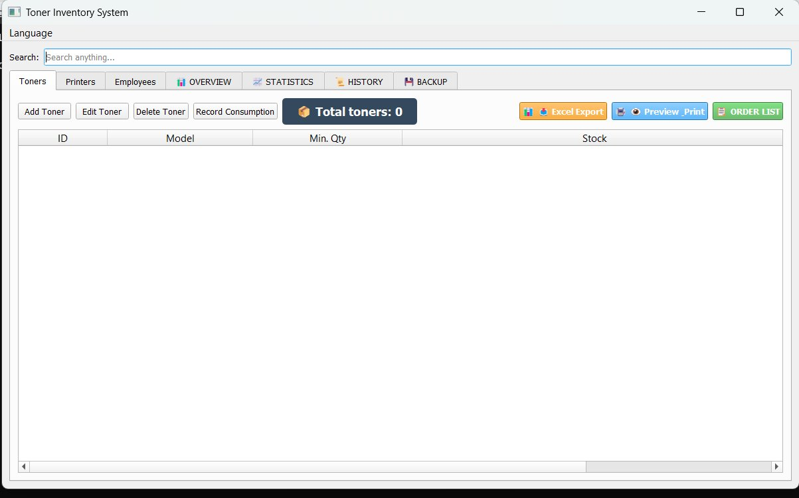
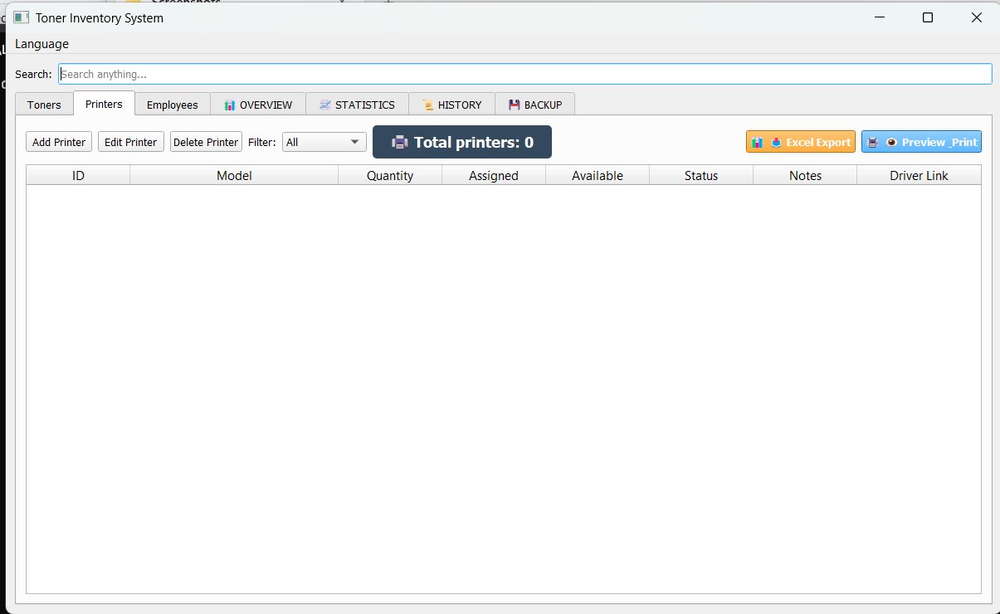
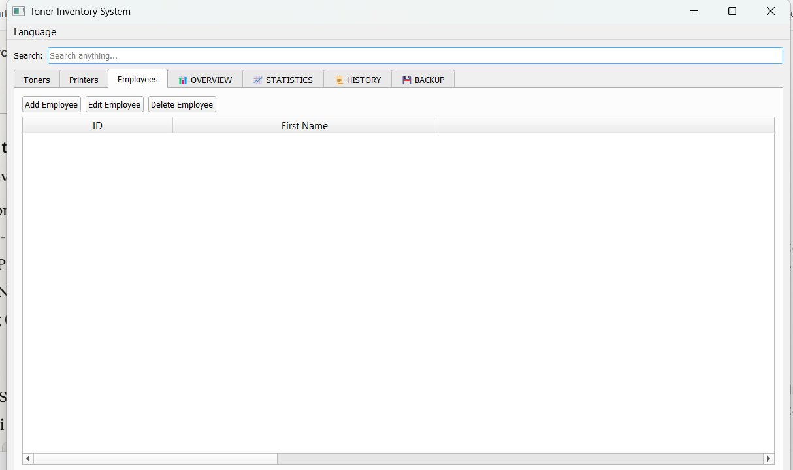
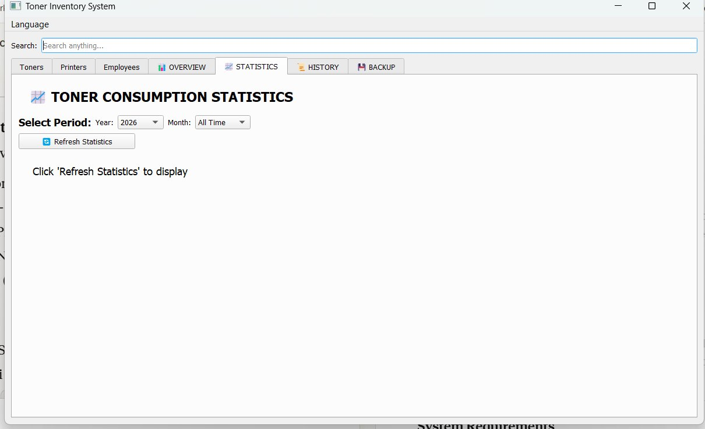
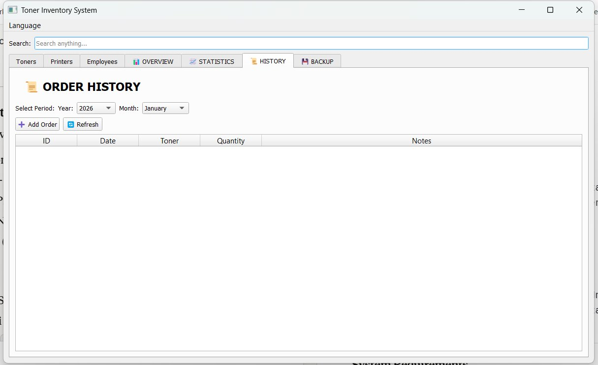
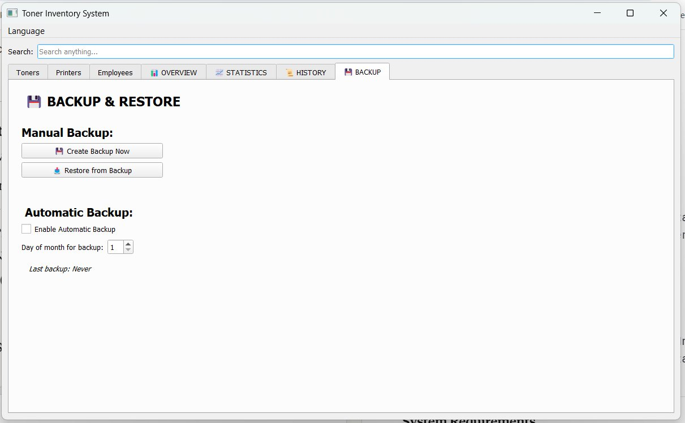

# 📦 Toner Inventory System

Professional desktop application for managing printer toners, printers, and employee assignments in companies.


## 🌟 Features

### Core Functionality
- ✅ **Toner Management** - Track all toner models, quantities, and minimum stock levels
- ✅ **Printer Management** - Manage printers with status tracking (Active/In Service/For Disposal)
- ✅ **Employee Management** - Assign printers to employees and track assignments
- ✅ **Automatic Reorder Alerts** - Get notified when toner stock falls below minimum
- ✅ **Consumption Tracking** - Record and track toner usage history
- ✅ **Dual Language Support** - Serbian and English interface

### Real-Time Monitoring
- 📊 **Live Stock Counter** - Real-time display of total toners and printers
- 🔄 **Auto-Update** - All counts update instantly on any change
- 🎯 **Color-Coded Status** - Visual indicators for stock levels and printer status

### Export & Print
- 📄 **Print Preview** - HTML preview with print button for all reports
- 📊 **Excel Export** - Export to professionally formatted Excel files
- 📋 **Multiple Reports** - Toners, Printers, Overview, Order Lists, and History

### User Experience
- 🔍 **Advanced Search** - Real-time search across all tables with highlighting
- 📏 **Resizable Columns** - Adjust column widths (automatically saved)
- 🎨 **Color Coding** - Red for low stock, green for available, yellow for in-service
- 💾 **Backup & Restore** - Built-in database backup and restore functionality

## 📸 Screenshots

### Toners Tab - Real-Time Stock Monitoring

*Manage all toner models with live stock counter and order list*

### Printers Tab - Printer Management

*Track printers with status, quantity, and real-time availability*

### Employees Tab

*Manage employees and their printer assignments*

### Overview Tab - Complete Overview

*Complete overview of employee-printer-toner relationships*

### Statistics Tab

*Toner consumption statistics and analytics*

### Order History

*Track all order history with filtering by date*

### Backup & Restore

*Built-in backup and restore functionality*

## 🚀 Installation

### Windows

1. **Download the latest release**
   ```
   Download toner_app_v2.0.exe from the releases page
   ```

2. **Run the application**
   - Double-click `toner_app_v2.0.exe`
   - No installation required!

### From Source (Windows/Linux)

1. **Clone the repository**
   ```bash
   git clone https://github.com/malkosvetnik/toner-inventory.git
   cd toner-inventory
   ```

2. **Install dependencies**
   ```bash
   pip install -r requirements.txt
   ```

3. **Run the application**
   ```bash
   python toner_app_multilang.py
   ```

## 📖 Usage Guide

### First Time Setup

1. **Launch the application**
2. **Add toners** - Click "Add Toner" and enter toner model, minimum quantity, and current stock
3. **Add printers** - Click "Add Printer" and specify printer model and quantity
4. **Link toners to printers** - Edit printer and select compatible toners
5. **Add employees** - Add employees and assign printers to them

### Daily Operations

#### Check Stock Levels
- View the **📦 Total toners** counter for total stock
- Red highlighted rows indicate toners below minimum
- Click **📋 ORDER LIST** for automatic order list

#### Record Toner Consumption
- Click **Record Consumption**
- Select toner and enter quantity used
- History is automatically tracked

#### Export Reports
- **Print**: Click 🖨️ **Preview_Print** for HTML preview
- **Excel**: Click 📊 **Excel Export** to save as .xlsx file

#### Search
- Use the search box at the top
- Search works across all tabs simultaneously
- Results are highlighted in green

### Backup & Restore

#### Create Backup
1. Go to **BACKUP** tab
2. Click **Create Backup Now**
3. Choose location to save `.db` file

#### Restore from Backup
1. Go to **BACKUP** tab
2. Click **Restore from Backup**
3. Select previously saved `.db` file

## 🛠️ Technical Details

### Built With
- **Python 3.8+** - Programming language
- **PyQt5** - GUI framework
- **SQLite3** - Database
- **openpyxl** - Excel file generation

### Database Schema

```sql
-- Toners
CREATE TABLE toneri (
    id INTEGER PRIMARY KEY,
    model TEXT NOT NULL,
    minimalna_kolicina INTEGER,
    trenutno_stanje INTEGER
);

-- Printers
CREATE TABLE stampaci (
    id INTEGER PRIMARY KEY,
    model TEXT NOT NULL,
    kolicina INTEGER DEFAULT 1,
    status TEXT DEFAULT 'Aktivan',
    napomena TEXT,
    driver_link TEXT
);

-- Employees
CREATE TABLE radnici (
    id INTEGER PRIMARY KEY,
    ime TEXT NOT NULL,
    prezime TEXT NOT NULL
);

-- Relationships
CREATE TABLE stampac_toneri (
    stampac_id INTEGER,
    toner_id INTEGER,
    FOREIGN KEY (stampac_id) REFERENCES stampaci(id),
    FOREIGN KEY (toner_id) REFERENCES toneri(id)
);

CREATE TABLE radnik_stampaci (
    radnik_id INTEGER,
    stampac_id INTEGER,
    FOREIGN KEY (radnik_id) REFERENCES radnici(id),
    FOREIGN KEY (stampac_id) REFERENCES stampaci(id)
);
```

### System Requirements

**Minimum:**
- Windows 7/10/11 or Linux
- 2GB RAM
- 50MB disk space

**Recommended:**
- Windows 10/11 or Ubuntu 20.04+
- 4GB RAM
- 100MB disk space

## 🔄 Version History

### Version 2.0.0 (2026-01-26)
**Major Update - Feature-Rich Release**

#### New Features
- ✨ Real-time stock counters for toners and printers
- ✨ Print and Excel export for Toners and Printers tabs
- ✨ Resizable columns with automatic save/restore
- ✨ Search functionality in edit dialogs
- ✨ Comprehensive overview tab showing all relationships

#### Improvements
- 🔧 Fixed status combobox unlimited change bug
- 🔧 Fixed search highlighting consistency
- 🔧 Display "0" instead of empty field in order lists
- 🔧 Show all records in Overview tab with red indicators for missing data
- 🔧 Enhanced export reports with dual counters (different models + total pieces)

#### Technical
- 📦 Added QSettings for persistent column widths
- 📊 SQL-based real-time calculations
- 🎨 Consistent color coding across all views

### Version 1.0.0 (Initial Release)
- Basic toner and printer management
- Employee assignments
- Order list generation
- Backup functionality

## 🤝 Contributing

Contributions are welcome! Please feel free to submit a Pull Request.

1. Fork the repository
2. Create your feature branch (`git checkout -b feature/AmazingFeature`)
3. Commit your changes (`git commit -m 'Add some AmazingFeature'`)
4. Push to the branch (`git push origin feature/AmazingFeature`)
5. Open a Pull Request

## 📝 License

This project is licensed under the MIT License - see the [LICENSE](LICENSE) file for details.

## 👤 Author

**Igor Davidović**

- GitHub: [@malkosvetnik](https://github.com/malkosvetnik)

## 🙏 Acknowledgments

- Thanks to all companies testing this application
- Built with ❤️ for warehouse and office management
- Special thanks to the PyQt5 community

## 📧 Support

For support, please open an issue on GitHub or contact via email.

## 🌍 Language Support

- 🇷🇸 **Srpski** (Serbian) - Default
- 🇬🇧 **English**

Switch language from the menu: **Language**

---

**Perfect for companies with 10-500+ printers** | **Save time on printer management** | **Never run out of toner again**
